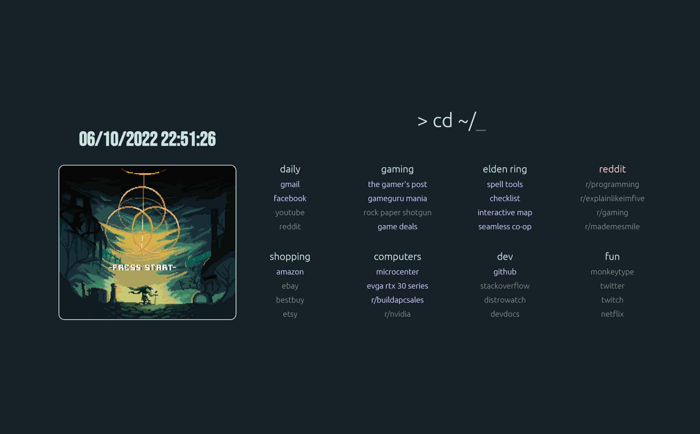

# Elden Ring browser startpage

[Live Preview](https://pav-osmolski.github.io/startpage/)

Please feel free to fork and make your own changes!

List of changes:

- Converted to CSS Flex
- Fully responsive
- Support for multiple right-containers, allowing more links
- Added Date/Time with JS
- Added fade-in on page load
- Fixed HTML validation issues
- Re-organised images into their own folder
- Elden Ring theme (please excuse my obsession)
- Fonts: Ubuntu and Bebas Neue
- Colour scheme: Elden Ring, controlled by the `--hue-rotate` variable (the image is not affected)
- Elden Ring gif: [Here](https://pinargokoglu.tumblr.com/post/675069910947364864/elden-ring)

