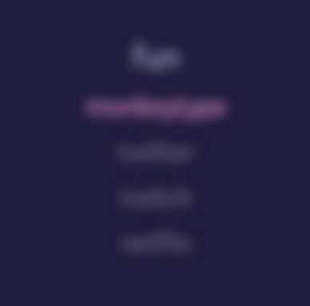
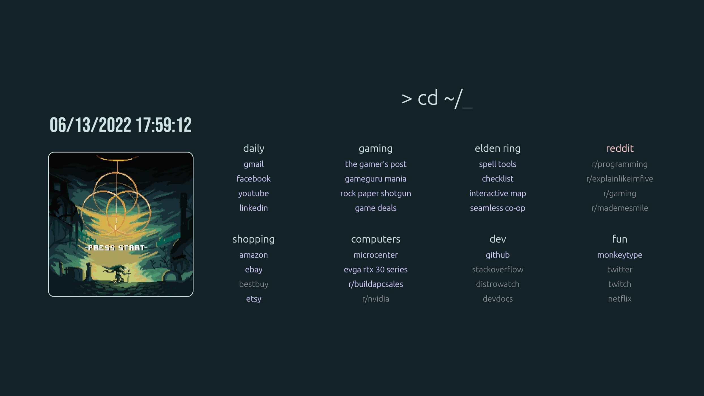
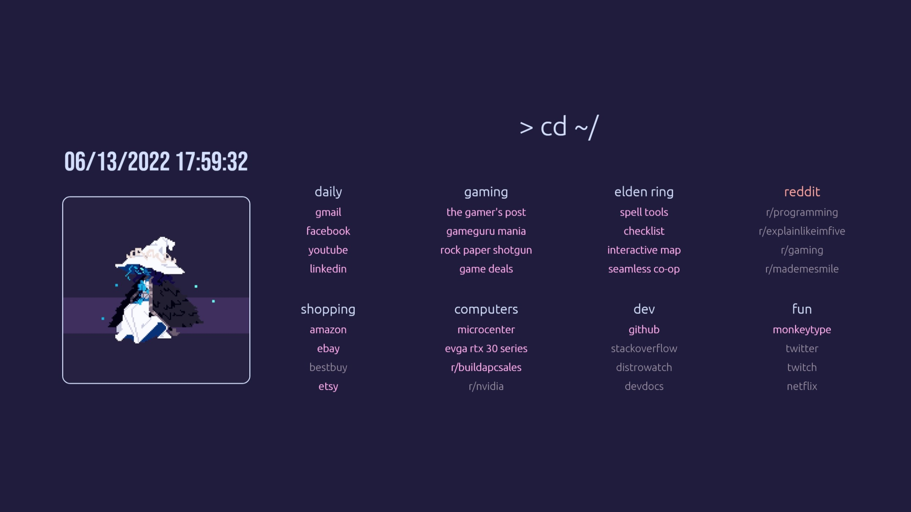
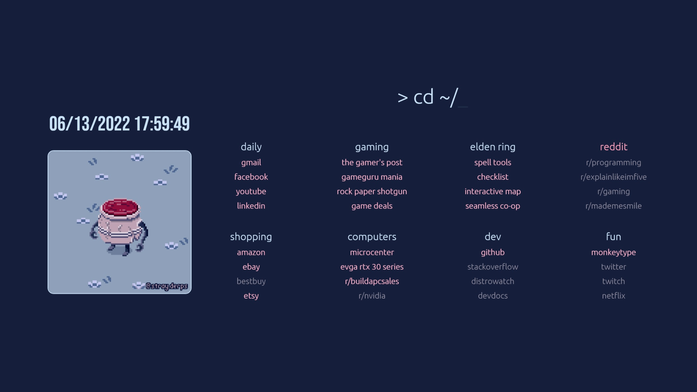
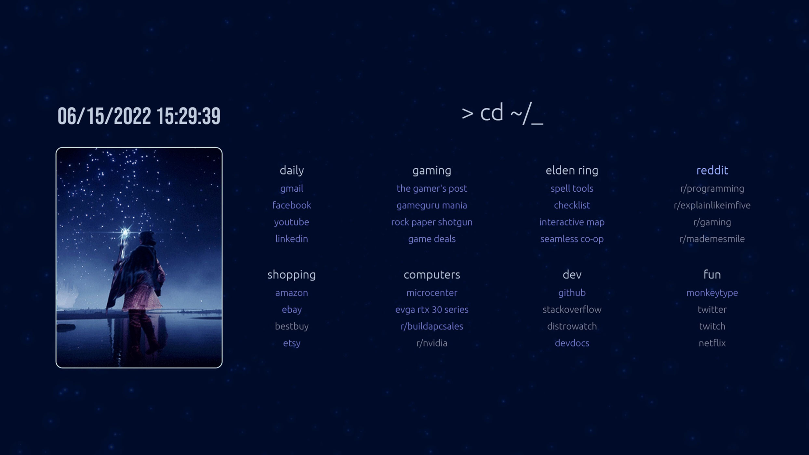
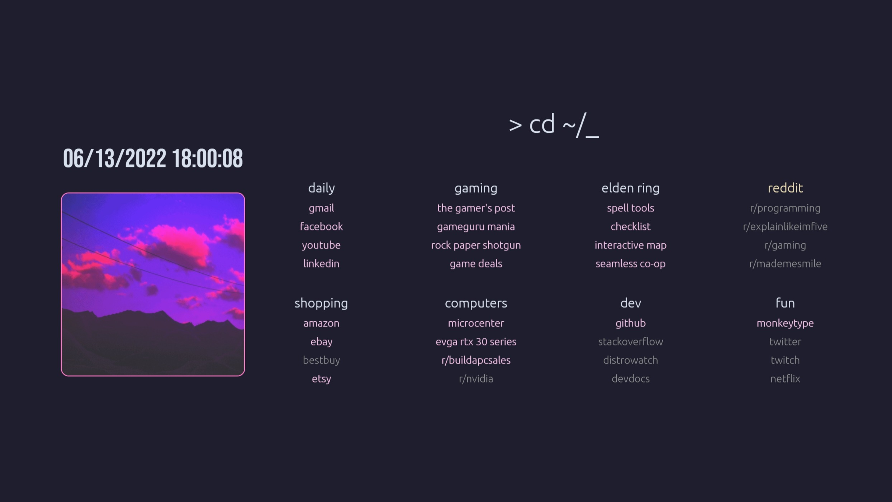

# ELDEN RING multi-theme browser startpage

[Live Preview](https://pav-osmolski.github.io/startpage/)

Please feel free to fork and make your own changes!

## List of changes:

- Converted to CSS Flex
- Fully responsive layout
- Support for multiple `bookmarks` containers
- Added search functionality
- Tabbed navigation for `links` containers using slick carousel
- Asynchronous JavaScript loader
- Both JS and CSS files can be instantiated based on element classes in DOM
- Added fade-in on page load
- Fixed HTML validation issues
- Re-organised images into their own folder
- Alternate theme styles are included in `style.css` under `/* Themes */` with examples shown below
- Edit `index.html` to change the `<html>` element class for an alternative theme, or be creative and add your own
- Image is set via the `--image-path` variable
- Fonts: Ubuntu and Bebas Neue
- Colour scheme: ELDEN RING, mostly dictated by the `--hue-rotate` variable
- ELDEN RING gif: [Here](https://pinargokoglu.tumblr.com/post/675069910947364864/elden-ring)

## Optional add-ons:
These add-ons will only load when required, based on whether the relevant element class is detected in the DOM. You can configure the JavaScript add-on list within `async-loader.js`.
- [slick carousel](https://kenwheeler.github.io/slick/) `
`
- [jQuery Ripples](https://github.com/sirxemic/jquery.ripples) `<body class="fade-in ripples">`
- [Date/Time](https://ricardometring.com/real-time-date-time-with-javascript) `<h1 id="#Date">`
- Animating stars `<body class="fade-in stars">`
- Search `<body class="fade-in search">`
- [jQuery](https://jquery.com/download/) `<body class="fade-in jquery">`

## Features:

Search functionality `<body class="fade-in search">`. The default is set to Google. You can change the search engine by modifying `action="https://www.google.com/search"`

Tabbed containers `
`

Privacy blur/unblur on hover `<ul class="blur">`

## How to install:

1. Clone this repo to a location on your hard disk, e.g. `C:/StartPages/`
2. Set your browser homepage to `file:///C:/StartPages/startpage/index.html`
3. Customise to your delight

## Currently implemented theme classes:

ELDEN RING Press Start `<html lang="en" class="default eldenring-start">`

ELDEN RING Lady Ranni `<html lang="en" class="default eldenring-ranni">` and if you're feeling adventurous `<body class="fade-in ripples">`

ELDEN RING Pot Boy `<html lang="en" class="default eldenring-potboy">`

ELDEN RING Ranni's Dark Moon `<html lang="en" class="default eldenring-ranni-dark-moon">` and for some extra magic `<body class="fade-in stars">`

Vapor by [nwvh](https://github.com/nwvh/startpage) `<html lang="en" class="default vapor">`

